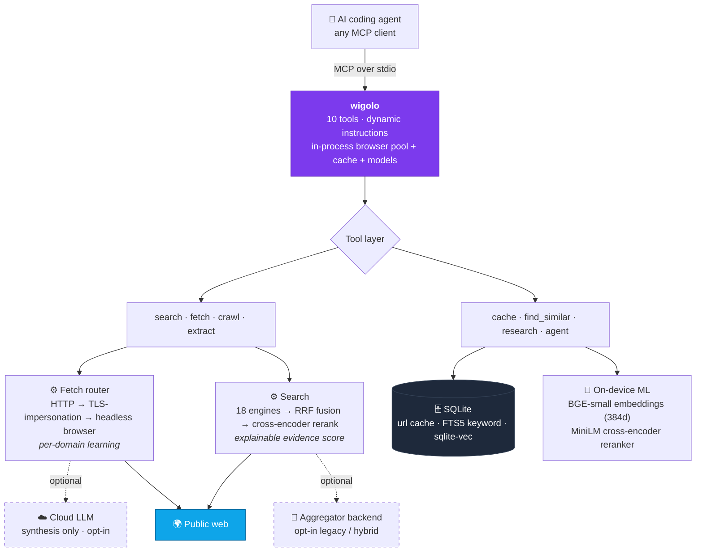

<div align="center">


Local-first web intelligence over MCP — **no keys, no cloud, no metered bill.**

<sub>works with&nbsp;&nbsp;**Claude Code · Cursor · Codex · Gemini CLI · VS Code · Windsurf · Zed · Antigravity**</sub>

[](https://www.npmjs.com/package/wigolo)
[](https://nodejs.org)
[](https://modelcontextprotocol.io)
[](#license)
[](#beta--feedback)

[Quickstart](#quickstart) · [Tools](#tools) · [Why wigolo](#why-its-different) · [Benchmark](#benchmark) · [Architecture](#architecture) · [Configuration](#configuration) · [Feedback](#beta--feedback) · [FAQ](#faq) · [Available on](#available-on) · [Contribute](#contributing)

</div>

---

wigolo runs on your machine as an MCP server and gives an AI coding agent one durable surface for everything web-related — **search, fetch, crawl, extract, cache, find-similar, research,** and autonomous gather loops. The core tools need no API keys, nothing it touches leaves `~/.wigolo/`, and there's no bill that grows with how much your agent thinks.

<div align="center">


</div>

## Quickstart

Requires **Node ≥ 20** and ~1.5 GB of free disk. macOS, Linux, and Windows.

One command wires the local engine into your agent and sets up the MCP connection. It runs headlessly with no prompts — components (the browser engine and on-device models) download automatically on first use, so init itself is instant and downloads nothing:

```bash
npx wigolo init --non-interactive --agents=<your-agent>
```

- **`<your-agent>`** — one or more of `claude-code` · `cursor` · `codex` · `gemini-cli` · `vscode` · `windsurf` · `zed` · `antigravity` (comma-separated). wigolo writes the MCP config and instructions for you — nothing else to set up.
- **Any other MCP-capable agent?** Omit `--agents` — init still runs headlessly, and you point your agent at wigolo's MCP server (`npx wigolo mcp`) yourself.
- **Want the components ahead of time?** Add `--warmup` to pre-cache the browser engine and on-device models during init instead of on first use, or run `npx wigolo warmup --all` anytime. **Prefer a guided setup?** Add `--wizard` for the interactive terminal wizard.

That's the whole setup — **search, fetch, crawl, extract, cache, and find-similar work with no API key.** Check it's healthy:

```bash
npx wigolo doctor
```

Not for you? `npx wigolo config --uninstall --yes` removes everything, cleanly.

### Manual MCP setup (any other agent)

The `--agents` flag has a built-in installer for each agent listed above — but it can't cover every agent in the world. For **anything else — your own custom or in-house agent, or any MCP-capable client we don't wire automatically yet** — set wigolo up by hand: it's just another MCP server. Install the engine once, then register it:

```bash
npx wigolo init --non-interactive        # headless setup, no agent wiring (components download on first use)
```

Most clients use an `mcpServers` block in a JSON config file:

```json
{
  "mcpServers": {
    "wigolo": {
      "command": "npx",
      "args": ["-y", "wigolo"]
    }
  }
}
```

`wigolo` with no subcommand starts the MCP stdio server (that is the default). If you installed it globally, use `"command": "wigolo", "args": []` instead.

**The file location — and the exact key — vary by client:**

| Agent | Config file | Servers key |
|-------|-------------|-------------|
| Cursor | `~/.cursor/mcp.json` | `mcpServers` |
| Windsurf | `~/.codeium/windsurf/mcp_config.json` | `mcpServers` |
| Gemini CLI | `~/.gemini/settings.json` | `mcpServers` |
| Antigravity | `~/.antigravity/mcp.json` | `mcpServers` |
| VS Code | user `mcp.json` (Command Palette → *MCP: Open User Configuration*) | `servers` |
| Zed | `~/.config/zed/settings.json` | `context_servers` |
| Claude Code | *(no file)* run `claude mcp add wigolo --scope user -- npx -y wigolo` (`--scope user` = global; drop it for project-only) | — |
| Codex | `~/.codex/config.toml` (TOML, not JSON) | `[mcp_servers.wigolo]` |
| Any other | wherever it registers MCP servers | its MCP-servers key |

Codex uses TOML instead of JSON:

```toml
[mcp_servers.wigolo]
command = "npx"
args = ["-y", "wigolo"]
```

To enable answer synthesis (below) for a hand-wired agent, add the provider and key to the server's `env`:

```json
{
  "mcpServers": {
    "wigolo": {
      "command": "npx",
      "args": ["-y", "wigolo"],
      "env": { "WIGOLO_LLM_PROVIDER": "gemini", "GEMINI_API_KEY": "<your-free-key>" }
    }
  }
}
```

### Let an AI set it up for you

Setup is simple enough to hand off to an AI. Ask your coding agent (Claude Code, Cursor, …) — or any chat assistant (ChatGPT, Claude, Gemini) — to do it, and it can follow the steps above. Paste a prompt like:

> Set up the **wigolo** MCP server for my agent. wigolo is a local-first MCP server installed with `npx wigolo init --non-interactive` (engine only — no API keys). Then register it in my agent's MCP config as an `mcpServers` entry `{ "command": "npx", "args": ["-y", "wigolo"] }`. Note the per-client differences: **VS Code** uses the `servers` key with `"type": "stdio"`; **Zed** uses `context_servers`; **Codex** uses TOML `[mcp_servers.wigolo]`; **Claude Code** uses the CLI `claude mcp add wigolo --scope user -- npx -y wigolo`. My agent is **<name>** and its MCP config is at **<path, or "wherever it registers MCP servers">**.

That prompt is self-contained, so even an assistant with no web access can act on it. If the assistant *can* browse, point it at this README (the **Manual MCP setup** section above has every client's exact config path) or the project's machine-readable **`llms.txt`** — both carry the full procedure, including the optional LLM-synthesis `env` below.

### Optional — enable answer synthesis

`research`, `agent`, and `search format=answer` use an LLM to *write* the final answer. Turn them on by setting a **provider and its key** (in your shell, or in your agent's MCP `env` block). `WIGOLO_LLM_PROVIDER` names the LLM — set it alongside the key:

```bash
export WIGOLO_LLM_PROVIDER=gemini
export GEMINI_API_KEY=<your-key>      # free from https://aistudio.google.com/apikey — the free tier is plenty
```

Any provider works — use `anthropic` + `ANTHROPIC_API_KEY`, `openai` + `OPENAI_API_KEY`, or `groq` + `GROQ_API_KEY`. To stay fully local and keyless, set `WIGOLO_LLM_PROVIDER=ollama` (or a local server URL) instead. Gemini is suggested because its free tier is more than enough for wigolo.

### Run with Docker

A prebuilt image runs the MCP server without installing Node yourself. It bundles the browser engine and on-device models, and the default command is the stdio MCP server.

```bash
docker run -i --rm -v wigolo-data:/data ghcr.io/knockoutez/wigolo
```

The `-i` flag keeps stdin open for the MCP protocol, and the volume persists the local cache and models across runs (first run downloads the models). Wire it into Claude Code:

```bash
claude mcp add wigolo --scope user -- docker run -i --rm -v wigolo-data:/data ghcr.io/knockoutez/wigolo
```

Any MCP client works the same way: set `command` to `docker` and `args` to the run flags above. The image is also on Docker Hub as `towhid69420/wigolo`.

## Tools

| Tool | What it does |
|------|--------------|
| 🔎 `search` | Multi-engine web search (18 direct adapters) with rank fusion, ML cross-encoder reranking, and an explainable per-result score. Pass a query **array** for parallel breadth. |
| 📄 `fetch` | Load one URL through a tiered router (HTTP → TLS-impersonation → headless browser) that auto-escalates on anti-bot challenges or SPA shells. Clean markdown + metadata + links. |
| 🕸️ `crawl` | Multi-page crawl — BFS, DFS, sitemap, or map-only. Per-domain rate limits, robots.txt respect, boilerplate dedup. |
| 🧩 `extract` | Structured data from a page: tables, metadata, JSON-LD, brand identity, named schemas (Article / Recipe / Product / …), or any custom JSON Schema. |
| 💾 `cache` | Query everything already seen — keyword (BM25) or hybrid (BM25 + on-device vectors). Plus stats, clear, and change detection. |
| 🧲 `find_similar` | Pages similar to a URL or a concept, via 3-way fusion of keyword + semantic + live web. |
| 🧠 `research` | Decompose a question → fan out sub-queries → fetch sources → synthesize a cited report (or a structured brief the host LLM writes from). |
| 🤖 `agent` | Autonomous gather loop: plan → search → fetch → extract → synthesize, with a step log, time budget, and optional output schema. |
| 🔁 `diff` + ⏱️ `watch` | See exactly what changed on a page since last visit; re-check on a schedule and deliver changes to a webhook. |

## Why it's different

wigolo isn't the free stand-in you settle for until the budget clears — it's built to hold the same line as the paid services in this lane, and it brings receipts. What actually separates it:

- **Built for agents, not humans.** One MCP call fans out many queries across many engines in parallel — something a serial host tool-loop can't replicate — with transparent per-result scoring and budget-aware output.
- **Honest output.** Stale cache, failed fetches, degraded backends, and truncation are surfaced in the result, never disguised as empty-but-successful data.
- **$0 per query, free to re-query.** Default search talks to public engines through direct adapters; the reranker and embeddings run on-device. Every response is cached, so asking again is instant and costs nothing.
- **Private by default.** Cache, embeddings, models, and config live under `~/.wigolo/`. Nothing reaches a third party unless you explicitly opt into an LLM for synthesis.

wigolo is a focused web layer for one agent on one machine — not a hosted SaaS, a vector database other apps query, or a browser-automation framework. Within that lane it goes toe-to-toe with the paid services on result quality — and the meter, the key, and the data-egress simply aren't there.

Here's what one real result looks like, dissected — including the failed engine and the weak result, because those are part of the answer too:

<div align="center">

<picture>
<source media="(prefers-color-scheme: dark)" srcset="assets/promo/anatomy-dark.svg">

</picture>

</div>

## Benchmark

> **All four tools converged on the same core answer — and only one of them handed back verbatim, byte-pinned evidence while doing it.**

One cold query, run live inside a single **Claude Fable 5** session and fanned out to four web tools on equal footing — built-in **WebSearch**, **wigolo**, **Tavily**, and **Exa** — then reported by the agent itself under one rule: judge on the evidence alone, no favoritism. The query: `when to choose logical vs streaming replication in Postgres`.

The headline is in the report itself: **all four tools converged on the same core answer.** Same top source as the paid tools, same conclusions — parity demonstrated, not asserted. On top of that, wigolo was the only tool of the four to return **verbatim quoted excerpts pinned to byte-offset source spans with citation IDs**, an **explainable per-result score decomposition** (cross-encoder, lexical, engine consensus), and **live per-engine telemetry** — and when two of its results were weak, **its own scorer flagged them as junk on-screen**. The cloud tools earn their line too: Exa rendered the official docs' comparison matrix in full. Both edges, stated straight, by the same model that drove all four tools.

One honest query, not a leaderboard — run your own and you'll see the same shape: the keyless local tool standing shoulder to shoulder with the paid services, handing your agent evidence the others don't, at $0 with nothing leaving your machine. Here's the full run:

<div align="center">


</div>

### Same fight, different physics

The paid tools are genuinely good — that's what makes the parity interesting. The differences that remain aren't quality, they're physics:

| | wigolo | Firecrawl | Exa | Tavily |
|---|:---:|:---:|:---:|:---:|
| Multi-engine web search | ✅ | ✅ | ✅ | ✅ |
| Fetch & structured extraction | ✅ | ✅ | ✅ | ✅ |
| Whole-site crawl & map | ✅ | ✅ | — | ✅ |
| Verbatim excerpts pinned to byte-offset source spans | ✅ | — | — | — |
| Explainable per-result score decomposition | ✅ | — | — | — |
| Persistent local memory — re-query instantly, offline | ✅ | — | — | — |
| Query data stays on your machine | ✅ | — | — | — |
| API key / account | none | required | required | required |
| Cost per query | $0 | metered | metered | metered |

<sub>Feature standing as of July 2026 — check each vendor's docs for current state.</sub>

That last row is the one that compounds — agents don't ask once, they ask in bursts:

<div align="center">

<picture>
<source media="(prefers-color-scheme: dark)" srcset="assets/promo/meter-dark.svg">

</picture>

</div>

## Architecture

A single Node process speaking MCP (JSON-RPC over stdio). Everything heavy is local and lazy-loaded, so a zero-key install pays nothing for the parts it isn't using.



- **Code beats model.** Deterministic work — canonicalization, rank fusion, dedup, schema matching, hashing — never touches an LLM. The model is reserved for judgment, opt-in, and capped per request. LLM-filled fields are checked against the source and nulled if absent, so hallucinations don't reach your output.
- **Routing on observable signals.** The fetch ladder escalates to a real browser on what it *sees* — SPA markers, challenge bodies, thin content — not domain guesses. It learns per-domain and unlearns when a site stops needing it.
- **Transparent, honest results.** Every result carries a score breakdown and a query-understanding block; degraded state is always surfaced, never hidden.

<div align="center">

<picture>
<source media="(prefers-color-scheme: dark)" srcset="assets/promo/ladder-dark.svg">

</picture>

<picture>
<source media="(prefers-color-scheme: dark)" srcset="assets/promo/fusion-dark.svg">

</picture>

</div>

## Configuration

A clean install works out of the box. A few settings meaningfully raise output quality — set them as environment variables or in your agent's MCP `env` block.

```bash
# 1. Synthesis — the biggest lever. research / agent / search-answer need an LLM
#    to write the final text. Set the provider AND its key (a key alone is ignored).
export WIGOLO_LLM_PROVIDER=gemini                   # names the LLM; free tier is plenty (or anthropic/openai/groq)
export GEMINI_API_KEY=<your-key>                    # that provider's key (ANTHROPIC_API_KEY / OPENAI_API_KEY / …)
#   ...or fully local & keyless:  export WIGOLO_LLM_PROVIDER=ollama   (or a local http URL)

# 2. Wider retrieval funnel
export WIGOLO_SEARCH=hybrid                         # core engines + aggregator fallback
export WIGOLO_GITHUB_TOKEN=...                      # GitHub code search 10 → 30 req/min + org-private

# 3. Land more fetches, stay warm
export WIGOLO_TLS_TIER=auto                         # per-domain TLS-impersonation past Cloudflare/DataDome
export WIGOLO_EAGER_WARMUP=1                        # pay the ~1s model load up front, not on first search
```

For repeated interactive use, run `wigolo serve` so the browser pool, embeddings, and reranker stay resident across calls. To stay 100% on-device, a local LLM endpoint + `WIGOLO_TLS_TIER=auto` is the honest minimal set.

**Per-call habits that pay off:** query **arrays** (`["a","b","c"]`) for parallel breadth · `search_depth: "deep"` for queries that matter · `include_domains` as a hard filter for docs lookups.

<details>
<summary><b>CLI commands</b></summary>

| Command | What it does |
|---------|--------------|
| `wigolo` / `wigolo mcp` | Start the MCP stdio server (the default command). |
| `wigolo init` | Set up wigolo headlessly: wire into detected agents, persist settings (components download on first use). `--non-interactive --agents=<csv> --provider=<name> --search=<backend>` for CI; `--warmup` to pre-cache components; `--wizard` for the interactive TUI; `--json` for a machine-readable summary. |
| `wigolo setup mcp` | Re-write just the MCP server entries, without the full wizard. |
| `wigolo doctor` | Cold-start health check — no network fetches. |
| `wigolo verify` | End-to-end smoke test (fetch, crawl, extract, search, rerank, embed). |
| `wigolo serve` | HTTP daemon — keeps subsystems warm across multiple clients. |
| `wigolo shell` | Interactive REPL (`--json` for piping). |
| `wigolo config` | Settings TUI; or headless `--set K=V`, `--export`, `--import`, `--cleanup`, `--uninstall --yes`. |
| `wigolo status` | Plain-text status summary. |
| `wigolo health` | Ping a running daemon's `/health`. |
| `wigolo backfill` | Embed cached pages that have no vector yet (`--batch-size`, `--dry-run`). |
| `wigolo plugin add\|list\|remove` | Manage custom extractor / search-engine plugins. |
| `wigolo uninstall` | Remove wigolo from agent configs (keeps your cache). |

</details>

<details>
<summary><b>Environment variables — search &amp; engines</b></summary>

| Var | Default | Effect |
|-----|---------|--------|
| `WIGOLO_SEARCH` | `core` | `core` (direct engines) / `searxng` (legacy) / `hybrid` (core + fallback). |
| `BRAVE_API_KEY` | — | When set, Brave joins the engine pool (env-only, never persisted). |
| `WIGOLO_GITHUB_TOKEN` | — | Lifts GitHub code search 10 → 30 req/min; enables org-private search (env-only). |
| `SEARXNG_URL` | — | External aggregator URL; when set, skips local bootstrap. |
| `SEARXNG_MODE` | `native` | `native` (Python venv) or `docker`. |
| `SEARXNG_PORT` | `8888` | Port for the native aggregator. |
| `SEARXNG_QUERY_TIMEOUT_MS` | `8000` | Per-query timeout to the aggregator. |
| `WIGOLO_MULTI_QUERY_CONCURRENCY` | `5` | Max parallel (query × engine) tasks. |
| `WIGOLO_MULTI_QUERY_MAX` | `10` | Max unique queries after normalization. |
| `WIGOLO_QUERY_EXPAND_VARIANTS` | `5` | Heuristic query-expansion variants. |
| `SEARCH_NARROW_RENDER_MAX_CANDIDATES` | `3` | Max candidates for which a domain-scoped (`include_domains`) search renders result pages in the browser engine during enrichment — recovers real content from JS-heavy documentation sites. Bounded to a few URLs; broad searches never escalate. `0` disables. |

</details>

<details>
<summary><b>Environment variables — fetch, network &amp; TLS</b></summary>

| Var | Default | Effect |
|-----|---------|--------|
| `USER_AGENT` | rotating Chrome UAs | Override the User-Agent header. |
| `FETCH_TIMEOUT_MS` | `10000` | HTTP request timeout. |
| `FETCH_MAX_RETRIES` | `2` | Retry budget for 429 / 502 / 503 / network errors. |
| `MAX_REDIRECTS` | `5` | Manual-mode redirect cap. |
| `PLAYWRIGHT_LOAD_TIMEOUT_MS` | `15000` | Browser `page.load` wait. |
| `PLAYWRIGHT_NAV_TIMEOUT_MS` | `30000` | Browser navigation timeout. |
| `SEARCH_FETCH_TIMEOUT_MS` | `15000` | Per-result hydration fetch in search. |
| `SEARCH_TOTAL_TIMEOUT_MS` | `30000` | Aggregate search budget. |
| `USE_PROXY` / `PROXY_URL` | `false` / — | Route fetch through a proxy. |
| `WIGOLO_TLS_TIER` | `off` | `off` / `auto` (per-domain learned) / `on` (always try TLS first). |
| `WIGOLO_TLS_BROWSER` | `chrome_142` | TLS fingerprint profile (`<browser>_<version>`). |
| `WIGOLO_TLS_SUCCESS_THRESHOLD` | `3` | Successes before a domain flips to TLS-first. |

</details>

<details>
<summary><b>Environment variables — browser pool &amp; auth</b></summary>

| Var | Default | Effect |
|-----|---------|--------|
| `MAX_BROWSERS` | `3` | Max concurrent contexts per browser type. |
| `BROWSER_IDLE_TIMEOUT` | `60000` | Idle context eviction (ms). |
| `BROWSER_FALLBACK_THRESHOLD` | `3` | HTTP failures on a domain before forcing the browser. |
| `WIGOLO_BROWSER_TYPES` | auto (all 3) | CSV of browsers to use (chromium, firefox, webkit). |
| `WIGOLO_CDP_URL` | — | Chrome DevTools endpoint for a remote / logged-in browser. |
| `WIGOLO_AUTH_STATE_PATH` | — | Playwright `storageState.json` (cookies / localStorage). |
| `WIGOLO_CHROME_PROFILE_PATH` | — | Full Chrome `User Data` dir (copied to temp per use). |

</details>

<details>
<summary><b>Environment variables — cache &amp; crawl</b></summary>

| Var | Default | Effect |
|-----|---------|--------|
| `CACHE_TTL_SEARCH` | `86400` | Search result cache TTL (s). |
| `CACHE_TTL_CONTENT` | `604800` | Page content cache TTL (7 days). |
| `WIGOLO_FAST_STALE_MAX_HOURS` | `24` | In `cache` mode, accept entries up to this age. |
| `WIGOLO_FAST_TIMEOUT_MS` | `800` | Tight timeout for cache-mode fallback fetches. |
| `CRAWL_CONCURRENCY` | `2` | Per-public-domain concurrent fetches. |
| `CRAWL_DELAY_MS` | `500` | Per-public-domain inter-request delay. |
| `CRAWL_PRIVATE_CONCURRENCY` | `10` | Per-private-domain concurrency (localhost / RFC1918). |
| `CRAWL_PRIVATE_DELAY_MS` | `0` | Per-private-domain delay. |
| `RESPECT_ROBOTS_TXT` | `true` | When false, robots.txt is not fetched. |
| `VALIDATE_LINKS` | `true` | When false, broken-link probe is skipped. |
| `WIGOLO_CRAWL_INDEX` | — | `1` → crawled pages enqueued for embedding. |
| `WIGOLO_WAIT_FOR_INDEX` | — | `1` → embedding queue runs synchronously per page. |

</details>

<details>
<summary><b>Environment variables — reranker, embedding &amp; relevance</b></summary>

| Var | Default | Effect |
|-----|---------|--------|
| `WIGOLO_RERANKER` | `onnx` | `onnx` (cross-encoder) / `none` (consensus + authority + recency boosts only). |
| `WIGOLO_RERANKER_MODEL` | `Xenova/ms-marco-MiniLM-L-6-v2` | Cross-encoder model ID. |
| `WIGOLO_RERANKER_IDLE_TIMEOUT_MS` | `300000` | Hold the model warm 5 min after last use. |
| `WIGOLO_EMBEDDING_MODEL` | `BAAI/bge-small-en-v1.5` | Embedding model (384-dim). |
| `WIGOLO_EMBEDDING_IDLE_TIMEOUT` | `1800000` | Idle unload (30 min). |
| `WIGOLO_EMBEDDING_MAX_TEXT_LENGTH` | `8000` | Truncation before embedding. |
| `WIGOLO_RELEVANCE_THRESHOLD` | `0` | Min relevance for the agent's post-fetch filter. |
| `WIGOLO_FIND_SIMILAR_COLD_START_THRESHOLD` | `0.02` | Fused score below which `find_similar` emits `cold_start`. |

</details>

<details>
<summary><b>Environment variables — LLM integration (all optional)</b></summary>

| Var | Default | Effect |
|-----|---------|--------|
| `WIGOLO_LLM_PROVIDER` | — | `anthropic` / `openai` / `gemini` / `groq` / custom URL (Ollama, vLLM, LM Studio). |
| `WIGOLO_LLM_MODEL` | — | Universal model override. |
| `WIGOLO_LLM_MODEL_{ANTHROPIC\|OPENAI\|GEMINI\|GROQ}` | — | Per-provider model override (highest precedence). |
| `WIGOLO_LLM_MAX_CALLS_PER_REQUEST` | `1` | Hard ceiling on LLM calls per tool invocation. |
| `WIGOLO_LLM_CACHE_TTL_DAYS` | `7` | LLM response cache TTL. |
| `WIGOLO_LOCAL_LLM` | `off` | Opt-in keyless local language model tier: `off` (default) / `auto` (auto-detect a local model server) / an explicit `http(s)://` endpoint. Off keeps the keyless path unchanged. |
| `WIGOLO_LOCAL_LLM_MODEL` | — | Preferred model name for the local tier; unset auto-picks an installed model. |
| `WIGOLO_LOCAL_LLM_BASE_URL` | `http://localhost:11434` | Endpoint probed when `WIGOLO_LOCAL_LLM=auto` (falls back to `WIGOLO_LLM_BASE_URL`, then the default local server). |
| `ANTHROPIC_API_KEY` / `OPENAI_API_KEY` | — | Read on every call; never persisted. |
| `GEMINI_API_KEY` / `GOOGLE_API_KEY` | — | Gemini provider key (either name; read on every call, never persisted). |
| `GROQ_API_KEY` | — | Same. |
| `WIGOLO_LLM_API_KEY` | — | Generic key for whichever provider `WIGOLO_LLM_PROVIDER` names. The provider-specific var wins; ignored during auto-detect. |

Keys can also live in the OS keychain or an AES-encrypted file (`wigolo init` / `wigolo config`) — never in `config.json`.

</details>

<details>
<summary><b>Environment variables — daemon, warmup, paths, logging &amp; misc</b></summary>

| Var | Default | Effect |
|-----|---------|--------|
| `WIGOLO_DATA_DIR` | `~/.wigolo` | Root for cache, models, keys, plugins, aggregator venv. |
| `WIGOLO_CONFIG_PATH` | `${DATA_DIR}/config.json` | Persisted config path. |
| `WIGOLO_DAEMON_PORT` | `3333` | Listen port for `wigolo serve`. |
| `WIGOLO_DAEMON_HOST` | `127.0.0.1` | Bind address. |
| `WIGOLO_EAGER_WARMUP` | — | `1` → pre-warm embed + rerank on startup (fire-and-forget). |
| `WIGOLO_BOOTSTRAP_MAX_ATTEMPTS` | `3` | Aggregator bootstrap retry limit. |
| `WIGOLO_HEALTH_PROBE_INTERVAL_MS` | `30000` | Background backend-health probe period. |
| `WIGOLO_PLUGINS_DIR` | `${DATA_DIR}/plugins` | Plugin discovery root. |
| `LOG_LEVEL` | `info` | `debug` / `info` / `warn` / `error`. |
| `LOG_FORMAT` | `json` | `json` or human-friendly `text`. |
| `WIGOLO_TELEMETRY` | — | `1` → local NDJSON event log (off by default, no PII). |
| `WIGOLO_TELEMETRY_ENDPOINT` | — | Also POST events fire-and-forget to this URL. |
| `WIGOLO_TUI_REDUCED_MOTION` | — | `1` → disable TUI spinners / animations. |

</details>

<details>
<summary><b>Common per-call options (tool arguments)</b></summary>

| Option | Tools | Notes |
|--------|-------|-------|
| `mode` | fetch, search, crawl, extract, find_similar | `cache` (fast, stale-OK) / `default` (smart routing) / `stealth` (full browser, no cache). |
| `search_depth` | search | `ultra-fast` (cache only) / `fast` / `balanced` (default) / `deep` (evidence + rerank highlights). |
| `query` | search | `string` or `string[]` — arrays fan out in parallel. |
| `include_domains` / `exclude_domains` | search, find_similar, research | Hard whitelist / blacklist (host-suffix match). |
| `format` | search | `answer` / `stream_answer` — triggers LLM synthesis with citations. |
| `citation_format` | search, crawl, research, agent | `numbered` / `json` / `anthropic_tags`. |
| `time_range` / `from_date` / `to_date` | search | Recency bounds. |
| `render_js` | fetch | `auto` / `always` / `never`. |
| `use_auth` | fetch, crawl | Route through configured auth (CDP > Chrome profile > storage state). |
| `actions` | fetch | Sequential browser actions (`click`, `type`, `wait`, `wait_for`, `scroll`, `screenshot`). |
| `section` | fetch | Extract a markdown subtree at a heading. |
| `strategy` | crawl | `bfs` / `dfs` / `sitemap` / `auto` / `map`. |
| `mode` (extract) | extract | `selector` / `tables` / `metadata` / `schema` / `structured` / `brand`. |
| `named_schema` | extract | `Article` / `Recipe` / `Product` / `CodeSnippet` / `Paper` / `EventListing`. |
| `depth` | research | `quick` / `standard` / `comprehensive`. |
| `max_pages` / `max_time_ms` | agent | Per-invocation page cap (default 3) and wall-clock budget. |
| `max_tokens_out` | most | Aggregate output-token budget (default 4000). |
| `include_full_markdown` | fetch, crawl, research, agent | `false` → evidence excerpts instead of full bodies. |

</details>

## Beta & feedback

wigolo is in **public beta**. Everything documented here works and is held to a 6,000-test suite — beta is about the polish bar, not stability. It stays beta until enough people have used it, kicked it, and starred it that calling it v1 means something.

That makes your feedback the whole game right now. Every report is read, usually the same day:

- 🐛 **[Report a bug](https://github.com/KnockOutEZ/wigolo/issues/new?template=bug_report.yml)** — broke, misbehaved, surprised you
- 💡 **[Request a feature](https://github.com/KnockOutEZ/wigolo/issues/new?template=feature_request.yml)** — something it should do
- 💬 **[Ask anything](https://github.com/KnockOutEZ/wigolo/discussions)** — questions, setups, show & tell

And if wigolo earns a place in your setup, the ways to keep it alive: a ⭐ **star** (it's how open source gets found), a **[☕ coffee](https://buymeacoffee.com/knockoutez)** (there's no paid tier and never will be), or just **[an email](mailto:ktowhid20@gmail.com)** — it goes straight to the one developer who wrote the code.

## FAQ

<details>
<summary><b>Free? What's the catch?</b></summary>

No catch by design. The expensive parts — ranking, embeddings, the browser engine — run on *your* hardware, so there's no per-query cost to recover and no reason for a meter. Sustained by donations; the AGPL license legally prevents a bait-and-switch into a closed hosted product.

</details>

<details>
<summary><b>Is the quality really on par with the paid services?</b></summary>

Run one query and judge — the benchmark section above is a live 4-way run, not a chart. Everyday agent queries land at parity; the paid tools still win some deep-extraction edge cases, and crawling is where wigolo is strongest. Every result shows its scoring, so you don't have to take anyone's word for it.

</details>

<details>
<summary><b>Won't public search engines block or rot?</b></summary>

It's engineered for exactly that: 18 engines fused with rank fusion (any one failing barely moves results), a tiered fetch ladder with per-domain learning, and an optional aggregator fallback. Degraded backends are *reported in the output*, never hidden — and the local cache means everything already seen keeps working regardless.

</details>

<details>
<summary><b>Is this kind of scraping OK?</b></summary>

wigolo reads the public web the way a browser does — robots.txt respected by default, per-domain rate limits, research-grade volumes for one agent on one machine. It's deliberately the polite end of the spectrum, not a harvesting platform.

</details>

<details>
<summary><b>AGPL — can I use this at work?</b></summary>

Yes, freely, company-wide. The license only bites if you *modify wigolo and run it as a network service* — then you must publish those modifications. Using it as a local dev tool carries zero obligation. Commercial-licensing questions: reach out.

</details>

<details>
<summary><b>Why 1.5 GB of disk?</b></summary>

That's the on-device brain: a full browser engine plus the ranking and embedding models the cloud services run on their side and bill you for. Disk is cheap; meters aren't.

</details>

## Available on

Grab wigolo wherever you manage packages or MCP servers:

- **npm** — [`wigolo`](https://www.npmjs.com/package/wigolo)
- **Docker** — [`ghcr.io/knockoutez/wigolo`](https://github.com/KnockOutEZ/wigolo/pkgs/container/wigolo) · [`towhid69420/wigolo`](https://hub.docker.com/r/towhid69420/wigolo)
- **Official MCP Registry** — `io.github.KnockOutEZ/wigolo`
- **Directories** — [Glama](https://glama.ai/mcp/servers/KnockOutEZ/wigolo) · [Smithery](https://smithery.ai/server/ktowhid20/wigolo) · [mcp.so](https://mcp.so/server/wigolo/KnockOutEZ) · [LobeHub](https://lobehub.com/mcp/knockoutez-wigolo)

## Contributing

Bug reports, feature requests, and PRs are all welcome — see **[CONTRIBUTING.md](CONTRIBUTING.md)**. Keep tool handlers thin (business logic lives in the domain modules), add tests, and run the suite before opening a PR. wigolo also has a plugin system for custom extractors and search engines: `wigolo plugin add <git-url>`.

## License

**[GNU AGPL-3.0-only](LICENSE).** Free to use, modify, and self-host — including inside a company. The one obligation: if you run a **modified** version as a network service, you must publish your modified source under the same license. That keeps wigolo open while preventing a closed, hosted fork. See **[SECURITY.md](SECURITY.md)** to report a vulnerability and **[TRADEMARK.md](TRADEMARK.md)** for use of the name. For commercial-licensing questions, reach out.

<div align="center">
<br>

wigolo is free and meant to stay that way — maintained, not paywalled.
If it saves you a metered search bill, a ⭐, a sharp issue, or a **[☕ coffee](https://buymeacoffee.com/knockoutez)** helps keep it sustainable.

<sub>Built and maintained by <a href="https://github.com/KnockOutEZ">@KnockOutEZ</a> · <a href="mailto:ktowhid20@gmail.com">ktowhid20@gmail.com</a></sub>

</div>
